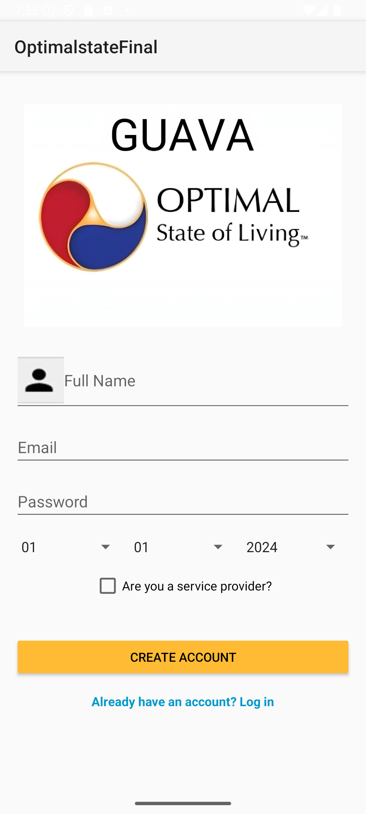
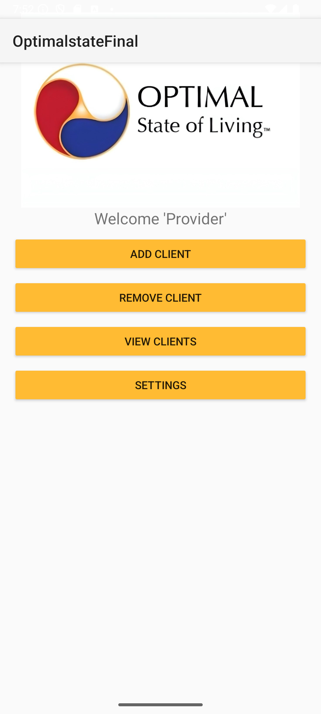
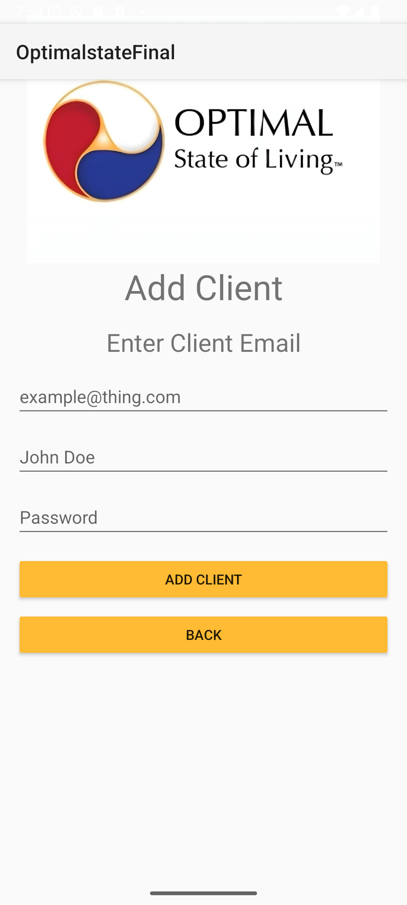
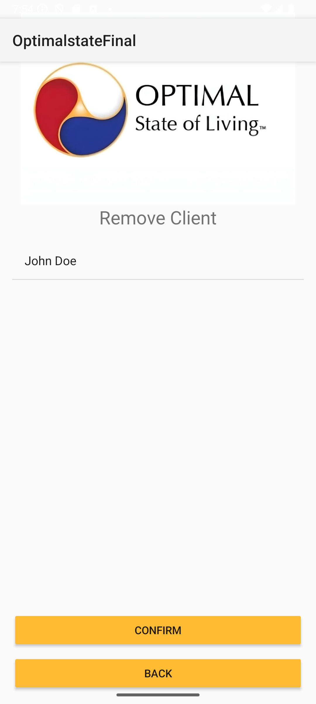
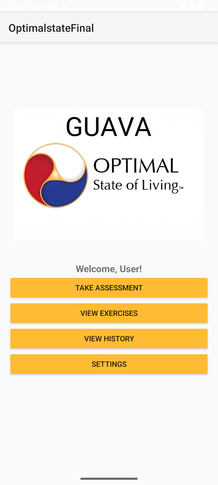
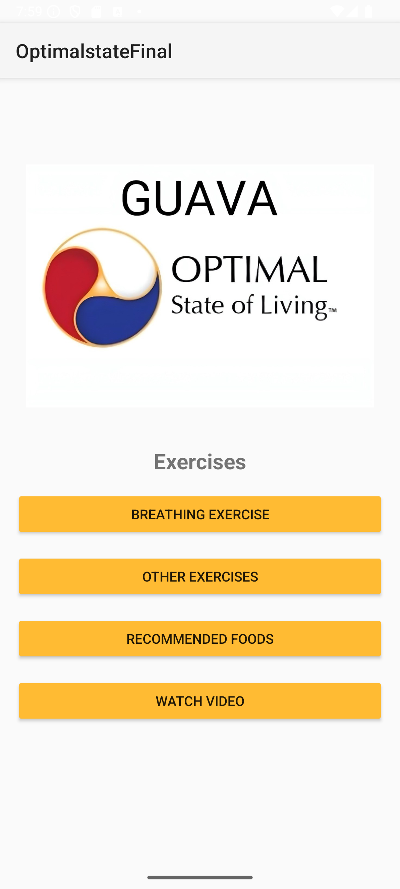
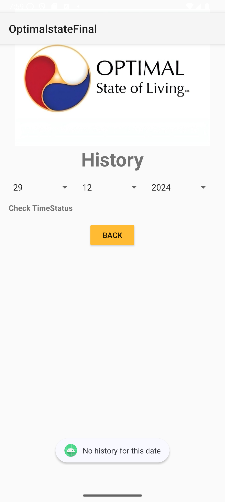
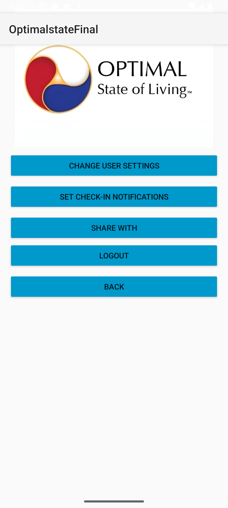

Application only works at android version 14 or higher
# Mood & Activity Tracker (Android)

Built a role-based Android app in Java with Firebase Authentication and Firestore. The app supports dual roles: **Users** (tracking mood, exercise, history) and **Providers** (managing clients, viewing assessments).

**Key Features:**
* **Architecture:** Modular design with multiple Activities, AlarmManager, and BroadcastReceiver.
* **Backend:** Secure Firebase Authentication and Cloud Firestore for real-time data sync.
* **UX/UI:** Scalable flows for personalized exercise suggestions and real-time dashboards.

---

## App Screenshots

### Authentication & Onboarding
| Login | Register |
|:---:|:---:|
|  |  |

### Provider Dashboard
| Provider Home | Add Client | Remove Client |
|:---:|:---:|:---:|
|  |  |  |

### User Features
| Home Screen | Assessments | Exercises |
|:---:|:---:|:---:|
|  |  |  |

### User History & Settings
| History | Settings |
|:---:|:---:|
|  |  |
